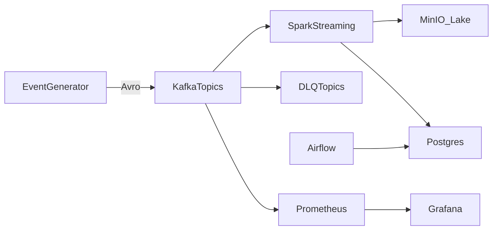

# Streamcart

Local, production-style **e-commerce streaming ETL**: simulated orders, payments, inventory, and clickstream → **Kafka + Schema Registry (Avro)** → **PySpark Structured Streaming** (bronze / silver / gold on MinIO) → **Postgres**, with DLQs, checkpoints, Airflow quality/backfill, and Grafana lag dashboards.

Interview story: at-least-once Kafka delivery, **idempotent serving-layer upserts**, **BACKWARD schema evolution**, watermarks for late events, and a batch DAG that recomputes gold so stream retries cannot double-count.

## Architecture



Details: [docs/architecture.md](docs/architecture.md)

## Stack

| Layer | Choice |
| --- | --- |
| Ingest | Python `confluent-kafka`, idempotent producer, Avro + Schema Registry |
| Bus | Apache Kafka 3.8 (KRaft), Kafka UI |
| Lake | MinIO (`s3a://lake/...`) |
| Stream ETL | PySpark 3.5 Structured Streaming |
| Serve | Postgres 16 (`ON CONFLICT` upserts) |
| Ops | Airflow LocalExecutor, Prometheus, Grafana, kafka-exporter |

## Quick start

Requires Docker Compose. On Windows, run `make` from Git Bash, or use the equivalent `docker compose` commands.

```bash
cp .env.example .env
make up
make seed-schemas
make produce          # leave running
make jobs             # Spark bronze / silver / gold
make ui               # prints local URLs
```

| UI | URL | Login |
| --- | --- | --- |
| Kafka UI | http://localhost:8082 | — |
| Grafana | http://localhost:3000 | admin / admin |
| Airflow | http://localhost:8085 | admin / admin |
| MinIO | http://localhost:9001 | minioadmin / minioadmin |
| Schema Registry | http://localhost:8081 | — |

```bash
make test             # pytest + ruff (no Docker)
docker compose exec postgres psql -U streamcart -d streamcart -c "SELECT * FROM v_gmv_last_24h;"
```

<!-- ## What to show in interviews

- **Contracts**: Avro subjects `{topic}-value`, compatibility `BACKWARD`, optional `coupon_code` in `order_v1_1.avsc`.
- **Chaos generator**: duplicates, late `event_ts`, negative amounts, poison bytes → silver quarantine + `*.dlq` topics.
- **Bronze**: raw Kafka bytes + offset/partition/`ingest_ts`, partitioned by `topic, dt`, checkpointed on MinIO.
- **Silver**: decode Confluent wire format, validate, `event_id` dedupe, 30-minute watermark, order ⨝ latest payment.
- **Gold**: `fact_orders` / `fact_payments` idempotent by `event_id`; streaming GMV is low-latency; **Airflow `streamcart_backfill_gold` rebuilds aggregates from facts**.
- **Ops**: consumer lag in Grafana; quality DAG fails the run if uniqueness or GMV checks break. -->

## Layout

```
producers/generator/   event simulator
schemas/avro/          data contracts
jobs/spark/            bronze_stream, silver_orders, gold_metrics
streamcart/            shared transforms, codec, quality
airflow/dags/          quality, reconcile, backfill
serving/sql/           Postgres DDL
infra/                 Prometheus + Grafana
```

## Talking points

See [docs/architecture.md](docs/architecture.md#interview-talking-points).
